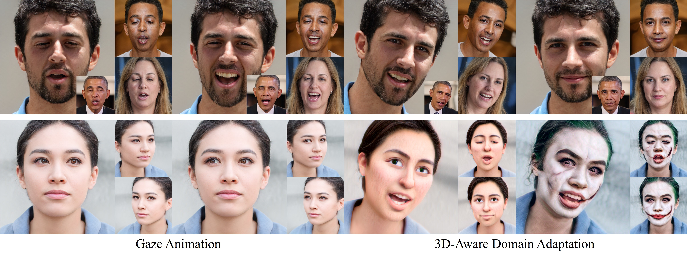

## Next3D: Generative Neural Texture Rasterization for 3D-Aware Head Avatars



**Next3D: Generative Neural Texture Rasterization for 3D-Aware Head Avatars**<br>
[Jingxiang Sun](https://mrtornado24.github.io/), [Xuan Wang](https://xuanwangvc.github.io/), [Lizhen Wang](https://lizhenwangt.github.io/), [Xiaoyu Li](https://xiaoyu258.github.io/), [Yong Zhang](https://yzhang2016.github.io/yongnorriszhang.github.io/), [Hongwen Zhang](https://hongwenzhang.github.io/), [Yebin Liu](http://www.liuyebin.com/)<br><br>


[**Project**](https://mrtornado24.github.io/Next3D/) | [**Paper**](https://arxiv.org/abs/2211.11208) | [**Twitter**](https://twitter.com/JingxiangSun42/status/1630489816226988032?s=20)

Abstract: *3D-aware generative adversarial networks (GANs) synthesize high-fidelity and multi-view-consistent facial images using only collections of single-view 2D imagery. Towards fine-grained control over facial attributes, recent efforts incorporate 3D Morphable Face Model (3DMM) to describe
deformation in generative radiance fields either explicitly or implicitly. Explicit methods provide fine-grained expression control but cannot handle topological changes caused
by hair and accessories, while implicit ones can model varied topologies but have limited generalization caused by the
unconstrained deformation fields. We propose a novel 3D
GAN framework for unsupervised learning of generative,
high-quality and 3D-consistent facial avatars from unstructured 2D images. To achieve both deformation accuracy
and topological flexibility, we propose a 3D representation
called Generative Texture-Rasterized Tri-planes. The proposed representation learns Generative Neural Textures on
top of parametric mesh templates and then projects them
into three orthogonal-viewed feature planes through rasterization, forming a tri-plane feature representation for volume rendering. In this way, we combine both fine-grained
expression control of mesh-guided explicit deformation and the flexibility of implicit volumetric representation. We further propose specific modules for modeling mouth interior
which is not taken into account by 3DMM. Our method demonstrates state-of-the-art 3D-aware synthesis quality and animation ability through extensive experiments. Furthermore, serving as 3D prior, our animatable 3D repre-
sentation boosts multiple applications including one-shot facial avatars and 3D-aware stylization.*

## Requirements

* 1&ndash;8 high-end NVIDIA GPUs. We have done all testing and development using V100, RTX3090, and A100 GPUs.
* 64-bit Python 3.9 and PyTorch 1.12.0 (or later). See https://pytorch.org for PyTorch install instructions.
* CUDA toolkit 11.3 or later.
* Python libraries: see [environment.yml](./environment.yml) for exact library dependencies.  You can use the following commands with Miniconda3 to create and activate your Python environment:
  - `cd Next3D`
  - `conda env create -f environment.yml`
  - `conda activate next3d`

## Getting started

Download our pretrained models following [the link](https://drive.google.com/drive/folders/1rbR5ZJ6LQYUSd5J5BkoVYNon_-Lb7KsZ?usp=share_link) and put it under `pretrained_models`. For training Next3D on the top of EG3D, please also download the pretrained checkpoint `ffhqrebalanced512-64.pkl` of [EG3D](https://github.com/NVlabs/eg3d/blob/main/docs/models.md).


## Generating media

```.bash
# Generate videos for the shown cases using pre-trained model

python gen_videos_next3d.py --outdir=out --trunc=0.7 --seeds=10720,12374,13393,17099 --grid=2x2 \
    --network=pretrained_models/next3d_ffhq_512.pkl --obj_path=data/demo/demo.obj \
    --lms_path=data/demo/demo_kpt2d.txt --lms_cond=True
```

```.bash
# Generate images and shapes (as .mrc files) for the shown cases using pre-trained model

python gen_samples.py --outdir=out --trunc=0.7 --shapes=true --seeds=166 \
    --network=pretrained_models/next3d_ffhq_512.pkl --obj_path=data/demo/demo.obj \
    --lms_path=data/demo/demo_kpt2d.txt --lms_cond=True
```

We visualize our .mrc shape files with [UCSF Chimerax](https://www.cgl.ucsf.edu/chimerax/). Please refer to [EG3D](https://github.com/NVlabs/eg3d) for more detailed instructions.


## Reenacting generative avatars

### Installation

Ensure the [Deep3DFaceRecon_pytorch](https://github.com/sicxu/Deep3DFaceRecon_pytorch/tree/6ba3d22f84bf508f0dde002da8fff277196fef21) submodule is properly initialized
```.bash
git submodule update --init --recursive
```
Download the pretrained models for FLAME estimation following [DECA](https://github.com/yfeng95/DECA) and put them into `data_preprocessing/ffhq/deca/data`; download the pretrained models for gaze estimation through the [link](https://drive.google.com/drive/folders/1Jgej9q5W2IYXRa-CWCldyTVXeHk-Oi-I?usp=share_link) and put them into `data_preprocessing/ffhq/faceverse/data`.

### Preparing datasets

The video reenactment input contains three parts: camera poses `dataset.json`, FLAME meshes ('.obj') and 2D landmark files ('.txt'). For quick start, you can download the processed talking video of President Obama [here]() and place the downloaded folder as `data/obama`. You can also preprocess your custom datasets by running the following commands:

```.bash
cd dataset_preprocessing/ffhq
python preprocess_in_the_wild.py --indir=INPUT_IMAGE_FOLDER
```

You will obtain FLAME meshes and 2D landmark files for frames and a 'dataset.json'. Please put all these driving files into a same folder for reenactment later. 


### Reenacting samples

```.bash
python reenact_avatar_next3d.py --drive_root=data/obama \
  --network=pretrained_models/next3d_ffhq_512.pkl \
  --grid=2x1 --seeds=166 --outdir=out --fname=reenact.mp4 \
  --trunc=0.7 --lms_cond=1
```


## Training


Download and process [Flickr-Faces-HQ dataset](https://github.com/NVlabs/ffhq-dataset) using the following commands. 
```.bash
cd dataset_preprocessing/ffhq
python runme.py
```
You can perform FLAME and landmarks estimation referring to [preprocess_in_the_wild.py](./dataset_preprocessing/ffhq/preprocess_in_the_wild.py). We will also integrate all the preprocessing steps into a script soon. 
The dataset should be organized as below:
```
    ├── /path/to/dataset
    │   ├── meshes512x512
    │   ├── lms512x512
    │   ├── images512x512
    │   │   ├── 00000
                ├──img00000000.png
    │   │   ├── ...
    │   │   ├── dataset.json
```

You can train new networks using `train_next3d.py`. For example:

```.bash
# Train with FFHQ on the top of EG3D with raw neural rendering resolution=64, using 8 GPUs.
python train_next3d.py --outdir=~/training-runs --cfg=ffhq --data=data/ffhq/images512x512 \
  --rdata data/ffhq/meshes512x512 --gpus=8 --batch=32 --gamma=4 --topology_path=data/demo/head_template.obj \
  --gen_pose_cond=True --gen_exp_cond=True --disc_c_noise=1 --load_lms=True --model_version=next3d \
  --resume pretrained_models/ffhqrebalanced512-64.pkl
```
Note that rendering-conditioned discriminator is not supported currently because obtaining rendering is still time-consuming. We are trying to accelerate this process and the training code will keep updating.
  
## One-shot portrait reenactment and stylization

Code will come soon.

## Citation

```
@inproceedings{sun2023next3d,
  author = {Sun, Jingxiang and Wang, Xuan and Wang, Lizhen and Li, Xiaoyu and Zhang, Yong and Zhang, Hongwen and Liu, Yebin},
  title = {Next3D: Generative Neural Texture Rasterization for 3D-Aware Head Avatars},
  booktitle = {CVPR},
  year = {2023}
}
```

## Acknowledgements

Part of the code is borrowed from [EG3D](https://github.com/NVlabs/eg3d) and [DECA](https://github.com/yfeng95/DECA).
